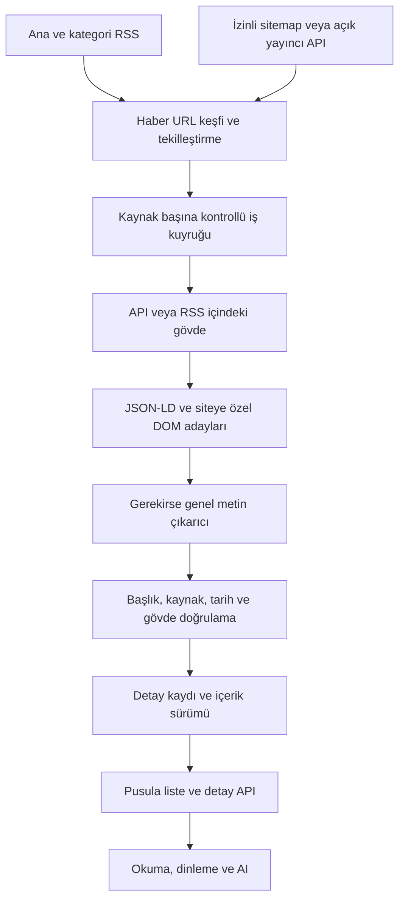

# Pusula haber toplama ve detay içeriği araştırması

10 Ekim 2026, Türkiye saati. Projedeki 56 kaynağın tamamı incelendi. Sonuç: haberleri belirgin biçimde daha eksiksiz almak mümkün; yalnızca RSS limitini artırmak yeterli değil. Liste keşfi, haber gövdesi edinme, doğrulama ve kalıcı saklama ayrı aşamalar olmalı. Kapalı içerik, yayıncının paylaşmadığı metin ve bütün geçmiş arşiv için genel bir eksiksizlik garantisi verilemez.

## 1. Araştırmanın kapsamı ve kanıtlar

- 56 ana RSS adresi ve ana adresten farklı 74 kategori adresi: toplam 130 katalog uç noktası.
- 53 ana feed haber döndürdü. İkisi boş/ayrıştırılamayan yanıt verdi; Bigpara HTTP 403 döndürdü. Başarılı 53 feed'in üçü belirgin biçimde eski.
- Kategori uç noktalarının 73'ü haber döndürdü; Daily Sabah politika feed'i boştu.
- İlk iki farklı haber URL'si seçilerek 106 detay adayı kontrol edildi. 104 sayfa HTTP 200 döndürdü. Investing'in iki detayı, robots.txt isteği 403 döndüğü için bu çalışmada alınmadı; haber sayfalarının da 403 vereceği iddia edilmiyor.
- Yakalanan aynı 104 HTML üzerinde uygulamanın gerçek `ArticleTextExtractor.extractFromHtml` fonksiyonu ve Trafilatura karşılaştırıldı. Ağ, kullanıcı aracısı ve sayfa seçimi farkı bu karşılaştırmayı etkilemiyor.
- Dört yayıncının herkese açık WordPress REST uç noktası ve sorunlu feed'ler için yedi alternatif adres ayrıca kontrol edildi.
- 56 ana feed ikinci kez indirildi; yakalanan byte'lar uygulamanın gerçek `RssNewsService` sınıfına MockClient üzerinden verildi. Uygulama ayrıştırıcısının sonuçları ayrı JSON'da.

İkinci ölçümde gerçek Flutter RSS ayrıştırıcısı 53 kaynaktan 3.621 kayıt çıkardı. Ağ yanıtından kayıt çıkarma kapsamı araştırma ayrıştırıcısıyla eşleşti; fakat 1.308 kayıtta görsel URL'si boştu ve 50 kayıtta tarih ölçüm anından 15 dakikadan fazla ilerideydi. İlk taramadaki 3.623 ile ikinci taramadaki 3.621 aynı anın sayımı değildir.

İlk ölçüm UTC 2026-10-09 22:00 civarında başladı; Türkiye'de 10 Ekim 01:00 civarıdır. İkinci geçiş farklı dakikalardadır, bu nedenle haber adetleri değişebilir. Bunlar bu ortamın ağındaki anlık gözlemlerdir; Türkiye'deki tüm operatörler veya sürekli erişilebilirlik için ölçüm değildir.

Veriler: [ilk kaynak ve detay taraması](news-source-audit.json), [üretim RSS ayrıştırıcısı ölçümü](news-rss-parser-audit.json), [alternatif feed'ler](news-feed-alternatives.json), [açık API denemeleri](news-api-probes.json). HTML ve RSS ham dosyaları işletim sisteminin geçici dizininde; repoya haberlerin tam metni eklenmedi.

## 2. Mevcut uygulamada içerik neden eksiliyor?

| Kod / davranış | Etkisi | Gereken değişiklik |
|---|---|---|
| `NewsProvider._doLoad`: `perSource: 8` | Bir kaynağın feed'inde yüzlerce haber olsa bile sekizi alınıyor. İlk taramada toplam 3.623 RSS kaydından, tüm kaynaklar seçilse dahi en fazla 421 kayıt alınabilir. | Listeyi sayfalama ile sun; edinme ve depolama limitini ekran limitinden ayır. |
| `_fetchSourceSafe` feed sırasındaki ilk kayıtları kesiyor; genel sıralama daha sonra yapılıyor | Feed kendi içinde tarihe göre sıralı değilse daha yeni bir haber ilk sekizin dışında kalabilir. | Tam edinme listesine tarih doğrulaması uygula; ekran için sınırlama yapılacaksa doğrulanmış sıralamadan sonra yap. |
| Ana akış sadece `primaryFeed` çağırıyor | Kategori haritası tanımlı olsa da ana akış tüm kategorilerin feed'lerini birleştirmiyor. AA'nın ana adresi genel arşiv değil `cat=guncel`; NTV'ninki gündem. | Kategori feed'lerinden de URL keşfi; canonical URL ile tekilleştirme. |
| Haber detay ekranı `article.summary/content` gösteriyor | RSS kısa ise okuma ekranı da kısa. Detay ekranının kendisi haber gövdesini yüklemiyor. | `ArticleDetailRepository` ve detay yükleme durumu; önizleme hemen, doğrulanmış gövde gelince içerik güncellensin. |
| `AiSettingsProvider._groundingText` ancak eldeki metin 400 karakterden kısaysa sayfayı çekiyor | 450 karakterlik bir tanıtım metni tam haber sanılarak sayfaya hiç gidilmeyebilir. AI için alınan metin okuma ekranına ve Article kaydına geri yazılmıyor. | Uzunluğa değil içerik durumuna göre gövde iste; okuma, dinleme ve AI aynı doğrulanmış detay kaydını kullansın. |
| `ArticleTextExtractor.maxChars = 6000` | Uzun haberin sonu okuma verisinden siliniyor. Ölçümde altı çıktı tam 6.000 karaktere dayandı. | Okuma metnini koru; AI için ayrı token bütçesi ve bölümleme uygula. |
| Regex ile yalnızca en uzun `<article>` ve en az 60 karakterlik `<p>` | Kısa fakat gerçek paragraflar, ara başlıklar, listeler, tablolar, farklı gövde yapıları ve galeri sayfaları kaçabiliyor. | DOM ayrıştırma, site adaptörleri ve genel okuyucu algoritması. |
| Gövdeden önce bütün `<script>` blokları atılıyor | JSON-LD içindeki `articleBody` hiç değerlendirilmiyor. | Yapılandırılmış veriyi temizlikten önce çıkar ve gövde adayı olarak doğrula. |
| Paragrafta `reklam`, `yorumlar` gibi kelimeler geçerse bütün paragraf atılıyor | Haberin konusu reklam veya yorumlar olduğunda gerçek metin de silinebilir. | Reklam/yorum bileşenlerini DOM bölgesi üzerinden ele; genel kelimeyi içerikten yasaklama. |
| Başarısız çıkarım `null` olarak oturum boyunca cache'leniyor | Geçici ağ hatası aynı oturumda bir daha denenmiyor; cache boyutu da sınırlandırılmamış. | Başarıya uzun, geçici hataya kısa TTL; sınırlı LRU ve kontrollü yeniden deneme. |
| Başarılı çekimde liste ve SQLite `replaceAll` ile değişiyor | Önceki haberler arşiv olarak birikmiyor. Bir kaynak başarısızsa, diğerlerinin başarısı eski o kaynağın haberlerini de listeden düşürebiliyor. | Kaynak bazlı güncelleme, upsert ve saklama politikası; eski veriyi tazelik bilgisiyle koru. |
| Hatalar sessizce boş listeye çevriliyor; `activeSources` istenen kaynaklar oluyor | Gerçekten veri alınan, boş dönen ve eski veri döndüren kaynaklar ayırt edilemiyor. `ExternalSource.available` da sabit true. | Kaynak sağlık sonucu ve gerçek başarılı kaynak sayısı. |
| Tarih yoksa `DateTime.now()` | Tarihi bilinmeyen eski içerik yeni haber gibi sıralanabilir. | `publishedAt`, `modifiedAt`, `discoveredAt` ve tarih güvenilirliği ayrı alanlar. |
| RSS görseli bulunamazsa haber sayfasının görsel metadata'sına gidilmiyor | İkinci geçişte 1.308/3.621 kayıtta boş görsel URL'si: Sabah 984, Habertürk 100, Diken 30, DW 15, Euronews 50, Medyascope 9, Bloomberg HT 50, ShiftDelete 20, Mynet 50. | Detay edinirken Open Graph ve JSON-LD görselini de oku; geçerli URL, boyut ve görsel kullanım hakkını ayrıca kontrol et. |

RSS kaynaklarının çoğu zaten kısa içerik sunuyor: ilk ölçümde yalnızca altı kaynağın `content` alanı medyanı 400 karakteri aşıyordu. Üç başka kaynağın `description` medyanı 400'ü aşıyordu. Uzun açıklama da otomatik olarak tam gövde değildir.

Yakalanan 104 detay sayfasının 102'sinde Open Graph veya haber JSON-LD'sinde görsel metadata'sı vardı. Bu sayım fotoğraf dosyasının indirilebildiğini, doğru haber fotoğrafı olduğunu veya yeniden yayımlama hakkını doğrulamaz. RSS'teki boş görselleri zenginleştirmek için güçlü bir aday kanaldır.

## 3. Somut kaynak sorunları

| Kaynak | Canlı gözlem | Öneri |
|---|---|---|
| Vatan | `rss/sondakika.xml` içindeki en yeni tarih 16 Ekim 2025. HTTP 200 olmasına rağmen eski. Denenen `rss/anasayfa.xml` 404. | Eski feed'i güncel haber kaynağı sayma. Yayıncıdan güncel feed veya izinli keşif adresi doğrulanana kadar eski olarak işaretle. |
| Nethaber | En yeni RSS tarihi 1 Mayıs 2025. | Güncellik kontrolü ve katalogda eski feed durumu. |
| Fotomaç | En yeni RSS tarihi 31 Mayıs 2025. Denenen alternatifler güncel, geçerli feed vermedi. | Site/feed keşfi veya yayıncı servisi; yalnızca ana URL'yi değiştirip çalışıyor varsayma. |
| Hürriyet Daily News | Katalogdaki `/rss` sıfır kayıt. `/rss.aspx` ve `/rss/news` denemeleri 64'er kayıt döndürdü. | `/rss.aspx` daha güncel gözlenen aday; katalog düzeltmesi ve regresyon örneği. |
| Habertürk Genç | `/rss/genc.xml` HTTP 200 fakat boş yanıt. | Ayrı kaynak olarak sağlıklı sayma; Habertürk genel feed'iyle aynı kaynak kimliğine körlemesine yönlendirme yapma. |
| Bigpara | Ana RSS HTTP 403. | İzinli alternatif veya yayıncı servisi araştır; hata durumunu göster. Investing/Bloomberg HT aynı kaynakmış gibi ikame edilmemeli. |
| Investing TR | RSS çalışıyor fakat örnek kayıtlarda açıklama/içerik boş; robots.txt 403 nedeniyle detay araştırması burada durduruldu. | Başlık-only durumunu açıkça koru; izinli veri servisini değerlendir. |
| Daily Sabah politika | Kategori adresi HTTP 200 fakat sıfır kayıt. | Kategori feed'ini yeniden keşfet; genel feed'den sınıflandırmayı geçici fallback olarak kullan. |
| CNN Türk, Akşam, Star | Feed'ler saat olarak gelecekte görünen tarihler döndürüyor. Tekrar kontrolde yerel saate benzeyen değerler `GMT` etiketiyle sunuluyordu. | Kaynak bazında doğrulanmış saat düzeltmesi ve anomali kaydı. Bütün kaynaklardan körlemesine üç saat çıkarma. |

DW feed'i RDF/RSS 1.0 biçiminde; ek kontrolle 15 kayıt bulundu. İlk araştırma betiğinin RDF kök kontrolündeki hata düzeltildi ve DW sonuçları yeniden ölçüldü. Bu, yayıncı arızası olarak sayılmadı.

## 4. Haber gövdesi için hangi yöntem işe yarıyor?

| Yöntem | Aynı 104 sayfadaki gözlem | Yorum |
|---|---|---|
| Mevcut Dart çıkarıcısı | 80 sayfada en az 400 karakterlik sonuç | Temel çözüm var; kapsama, kesilme ve yanlış bölge riskleri önemli. |
| Trafilatura, precision modu, yorumlar kapalı | 92 sayfada en az 400 karakter | Bu örneklemde daha geniş metin bulma kapsamı. Tamlık/doğruluk yüzdesi değildir. |
| JSON-LD `articleBody` | 58 sayfada en az 400 karakter | Tek başına yeterli değil; birçok yayıncı bu alana yalnızca spot yazıyor. |
| Trafilatura veya JSON-LD adayı | 93 sayfada en az 400 karakter | Üretim başarısı diye sunulamaz: aday seçimi ve gövde doğrulaması henüz yok. |

Örnekler, karakter sayıları:

| Örnek | Mevcut | Trafilatura | JSON-LD | Çıkarım |
|---|---:|---:|---:|---|
| TRT Haber, ikinci haber | 6.000 | 12.069 | 0 | Okuma metnindeki 6.000 sınırı kaldırılmalı. |
| Takvim, ilk haber | 0 | 4.199 | 3.520 | JSON-LD + DOM ile mevcut başarısızlığı giderebiliriz. |
| CHIP, galeri örneği | 0 | 1.285 | 5.398 | Galeri için ayrı davranış gerekir; genel algoritma da tüm slaytları almamış olabilir. |
| Bianet, ilk haber | 0 | 10.390 | 286 | Yapılandırılmış veri kısa; esas gövde DOM'dan gelmeli. |
| AA English, ikinci haber | 492 | 53 | 42 | Daha uzun olan otomatik olarak doğru değildir; mevcut sonuçta başka sayfa metni karışmış olabilir. Elle doğrulama gerekli. |
| TRT Haber, ilk haber | 0 | 398 | 0 | Kısa ama gerçek haberler 400 eşiğinin altında kalabilir. Uzunluk kuralı tamlık ölçütü değildir. |

Bu örneklerin URL'leri ham raporda. Uzunluğu karşılaştırmak eksik adayları bulur; doğru paragraf, doğru haber ve eksiksizlik için etiketlenmiş referans metin gerekir. Sonraki aşamada her kaynak için kısa haber, uzun haber, galeri/video ve canlı blogdan oluşan bir doğrulama seti hazırlanmalı.

Trafilatura metin, metadata ve yapısal çıktıları destekliyor; precision ve recall tercihleri farklı sonuç verebilir. Bu proje için benim önerim sunucuda önce kaynak adaptörü/yapılandırılmış veri, sonra Trafilatura fallback. Node altyapısı seçilirse Mozilla Readability alternatifidir; aynı örneklemde ayrıca ölçülmeden daha iyi olduğu söylenemez. [Trafilatura kullanım belgeleri](https://trafilatura.readthedocs.io/en/latest/usage-python.html), [Mozilla Readability](https://github.com/mozilla/readability/blob/main/README.md).

## 5. Açık API denemeleri ve ücretli seçenekler

| Kaynak/yöntem | Gerçek deneme / resmi belge | Karar |
|---|---|---|
| Diken WordPress API | Bir post döndü, içerik 1.679 karakter. | Siteye özel API adaptörü adayı. |
| Medyascope WordPress API | Bir post döndü, içerik 7.780 karakter. | Regex yerine daha yapısal giriş adayı. |
| ShiftDelete WordPress API | Bir post döndü, içerik 3.187 karakter. | RSS keşfi + post API gövdesi mümkün. |
| Veryansın WordPress API | HTTP 403. RSS gövdesi ise kullanılabilir. | WordPress tabanı API erişimini garanti etmiyor. |
| NewsAPI.org | Resmi `content` alanı 200 karakterde kesiliyor. | Tam haber problemi için uygun ana çözüm değil. |
| GNews | Resmi açıklama: ücretli planlarda tam metin, ücretsiz planda kısa içerik ve 12 saat gecikme. | Ancak hedef 56 kaynağın kapsamı, içerik hakları ve saklama şartları ayrıca doğrulanırsa yardımcı seçenek. |
| World News API Extract News | URL'den gövde, yazar, tarih ve görsel metadata çıkarma servisi. | Kendi çıkarıcımıza ücretli fallback olarak örneklemle denenebilir. Giriş/ödeme duvarını çözmeyi garanti etmiyor. |
| AA yayıncı aboneliği | Resmi abonelik başvurusu var. | Ajansın sunduğu profesyonel paketin kapsamı ve uygulamada kullanım hakkı teklif/sözleşmeyle alınmalı. |

Açık API denemelerinde sadece erişim ve metin alanı kontrol edildi; sayfalama, yayıncı lisansı ve tüm arşiv kapsamı doğrulanmış sayılmaz. WordPress post şeması `content` alanını sunar; her site bunu açmak zorunda değildir. [WordPress post API](https://developer.wordpress.org/rest-api/reference/posts/), [NewsAPI content sınırı](https://newsapi.org/docs/endpoints/everything), [GNews özellikleri](https://gnews.io/faq), [GNews veri erişim sınırları](https://docs.gnews.io/article-availability), [World News çıkarma API'si](https://worldnewsapi.com/docs/extract-news/), [AA abonelik başvurusu](https://www.aa.com.tr/tr/p/abonelik-talepleri).

Ücretli API için hesabı/anahtarı kullanarak satın alma veya deneme aboneliği açılmadı. Eski `api-search.md` içindeki fiyat ve lisans varsayımları güncel kararın temeli yapılmamalı. Özellikle herkese açık RSS erişimi tam metin ve fotoğrafı yeniden yayımlama izni anlamına gelmez. TRT'nin şartları bireysel kullanım dışındaki kullanım ve arşivleme konusunda sınırlamalar içeriyor. GNews de üçüncü taraf haklarını kullanıcıya bırakıyor; sistematik veri tabanı oluşturma kısıtları bulunuyor. Bu nedenle ücretli bir API, sınırsız haber arşivimiz için otomatik lisans çözümü sayılmamalı. [TRT şartları, bölüm 5.2](https://www.trthaber.com/kullanim-sartlari.html), [GNews şartları, bölümler 3 ve 7](https://gnews.io/legal/terms-of-service).

## 6. Önerdiğim üretim akışı



Bu bir öneridir; bu araştırma sırasında uygulamanın veri akışı değiştirilmedi.

**URL keşfi:** RSS'yi bırakmamak gerekiyor. Ana + kategori feed'leri geniş kapsama sağlar. İzinli normal sitemap ve açık yayıncı API'si boşlukları tamamlar. Google News sitemap'i yakın tarihli keşif içindir: iki günlük içerik penceresi ve dosya başına en fazla 1.000 haber kaydı vardır; tüm geçmiş arşivin kaynağı değildir. [Google News sitemap belgesi](https://developers.google.com/search/docs/crawling-indexing/sitemaps/news-sitemap).

**Gövde edinme:** API/RSS, JSON-LD ve DOM ayrı adaylar üretmeli. Aynı sayfaya ait oldukları başlık/canonical eşleşmesiyle kontrol edilmeli. İlk JSON-LD veya en uzun metin doğrudan seçilmemeli. Başlıklar, paragraflar, alıntılar ve listeler korunmalı; görseller/caption'lar metinden ayrı tutulmalı. Sayfalı galeri ve canlı blog için farklı adaptör kullanılmalı. Tarayıcıyla JS render ancak açık ve izinli içeriğin buna ihtiyaç duyduğu doğrulanırsa son seçenek olmalı; her haber için tarayıcı açmak gereksiz maliyet.

**Kayıt sözleşmesi:** `canonicalUrl`, `sourceId`, `title`, `summary`, `bodyBlocks`, `authors`, `publishedAt`, `modifiedAt`, `discoveredAt`, `images`, `contentStatus`, `extractionMethod`, `extractedAt`, `contentHash`, `extractorVersion`, `qualityWarnings` alanları. Eksik gövde, kısıtlı erişim, geçici hata ve doğrulanmış gövde ayrı durumlar olmalı. Takip parametreleri temizlenirken haber kimliğine ait gerçek query parametreleri korunmalı. URL kimliği için 32 bit hash yerine güçlü hash/benzersiz canonical anahtar tercih edilmeli.

**Ağ ve önbellek:** Kaynak başına düşük eşzamanlılık; 429/5xx/zaman aşımı için sınırlı backoff, `Retry-After`, bozuk kaynak için geçici durdurma. 403 durumunu sürekli yeniden deneyen döngü olmamalı. İlk taramada 15 ana feed ETag, 34'ü Last-Modified gönderiyordu; koşullu GET ve 304 ile aynı dosya tekrar indirilmez. Cache gövdesi yoksa 304 sonucu kullanılamaz. Detay sonuçları kalıcı ve sürümlü saklanmalı; güncellenen haber yeniden alınabilmeli. [HTTP koşullu istek standardı](https://www.rfc-editor.org/rfc/rfc9110.html).

**Kaynak sağlığı:** HTTP durumu yanında son yayın tarihi, son başarılı çekim, kayıt sayısı, ayrıştırma başarısı ve detay kalite oranı izlenmeli. Günlerce eski bir feed'in HTTP 200 olması yeterli değil. Kısmi başarısızlıkta diğer kaynakların haberleri gösterilmeli, başarısız kaynağın cache'i eski olduğu belirtilerek korunmalı. `robots.txt` erişim/tarama yönergesi, kullanım lisansından ayrı tutulmalı. [Robots Exclusion Protocol](https://www.rfc-editor.org/info/rfc9309/).

**Flutter:** Başlık ve önizleme hemen gösterilir; detay ayrı yüklenir ve SQLite'a yazılır. Geri dönüp açınca gereksiz istek yapılmaz. Kaydedilmiş haberde gövde ve sürüm birlikte korunur. Eksik metin varsa kullanıcıya gerçek durum ve kaynak bağlantısı sunulur. AI, sesli özet ve soru-cevap kendi başlarına farklı metin çekmek yerine ortak detay kaydını kullanır. Okuma metni kesilmez; AI bütçesi bağımsızdır.

**Sunucu tercihi:** Bu kapsam için Python + Trafilatura kullanan küçük bir toplayıcı/worker ve uygulamaya JSON sunan servis öneriyorum. FastAPI bir seçenek; esas gereklilik zamanlanmış işler, adaptörler, kalıcı kayıt ve ölçüm. Repo içindeki `web-service` şu anda aktif bir toplayıcı uygulaması değil, storage kalıntıları içeriyor; Flutter `ExternalNewsRepository` de backend çağırmıyor. Mevcut bir çalışan PHP servisi varmış gibi varsayılmamalı. Sunucusuz alternatifte aynı detay repository/adaptörleri Flutter'da kurulabilir, fakat her cihazın yayıncılara ayrı gitmesi, ortak arşiv eksikliği ve bakım dağıtımı devam eder.

## 7. Uygulama sırası ve başarı ölçütleri

1. Kaynak sağlık modeli, eski/boş feed durumları ve HDN adres düzeltmesi. Kategori feed'lerinden birleşik keşif, canonical tekilleştirme, kaynak bazlı cache birleştirme.
2. Ortak detay repository ve içerik durumları. JSON-LD + DOM + kaynak adaptörleri; okuma metnindeki 6.000 sınırını kaldırma; detay ekranını repository'ye bağlama.
3. Diken/Medyascope/ShiftDelete API adaptörlerini doğrulama; kısa haber, uzun haber, galeri ve canlı blog regresyon setleri. İşe yaramayan adaptör için kontrollü genel çıkarıcı fallback.
4. Sunucu worker, periyodik toplama, kalıcı arşiv ve sayfalama. Başlangıçta 15 dakikada 56 ana feed yaklaşık 5.376 istek/gün; 130 uç noktanın tamamı aynı sıklıkta yaklaşık 12.480 istek/gün eder, detay istekleri hariç. Bu matematiksel tahmindir; gerçek program kaynağın güncellenme hızına, izinlerine ve cache başlıklarına göre uyarlanmalı.
5. İzin/lisansı uygun kaynaklarda arşiv ve görsel kullanımını genişletme; ücretli alternatifleri gerçek Türkçe örneklem ve kullanım şartlarıyla kıyaslama.

Üretime geçiş ölçütü sadece “boş olmayan metin” olamaz. Kaynak bazında elle doğrulanmış gövde kapsamı, alakasız paragraf oranı, haber sonunun korunması, kısa haber doğruluğu, kaynak güncelliği, mükerrer URL, p95 gecikme, ağ veri miktarı ve başarısızlık sonrası toparlanma ölçülmeli. %100 tüm kaynak/tüm geçmiş/tüm gövde sözü yerine hangi kaynakta hangi içerik türünün desteklendiği açıkça kaydedilmeli.

## 8. Bütün kaynakların sonuç matrisi

RSS sütunları ilk taramadaki kayıt sayısı ve en yeni tarihtir. `spot / gövde` RSS alanlarının medyan karakter sayılarıdır; gövde 0 olduğunda uzun açıklama yine bulunabilir. Detay sütunları ilk ve ikinci örneğin karakter sayılarıdır. `—` alınmayan örnek; `0` çıkarılamayan veya bulunmayan gövde. Bunlar tamlık puanı değildir.

| Kaynak / feed | RSS kaydı | En yeni tarih | RSS spot / gövde | Mevcut detay | Trafilatura detay | JSON-LD detay |
|---|---:|---|---:|---:|---:|---:|
| [Anadolu Ajansı](https://www.aa.com.tr/tr/rss/default?cat=guncel) | 27 | 2026-10-10T00:27:21+03:00 | 159 / 0 | 4158 / 2136 | 4486 / 2354 | 208 / 112 |
| [TRT Haber](https://www.trthaber.com/manset_articles.rss) | 60 | 2026-10-10T00:23:00+03:00 | 201.5 / 230.5 | 0 / 6000 | 398 / 12069 | 0 / 0 |
| [Sabah](https://www.sabah.com.tr/rss/news.xml) | 984 | 2026-10-10T00:36:00+03:00 | 22.0 / 0.0 | 1586 / 0 | 1582 / 344 | 1699 / 344 |
| [Sözcü](https://www.sozcu.com.tr/feeds-haberler) | 50 | 2026-10-10T00:46:45+03:00 | 63.0 / 0.0 | 6000 / 1168 | 5981 / 848 | 5981 / 848 |
| [Hürriyet](https://www.hurriyet.com.tr/rss/anasayfa) | 70 | 2026-10-09T21:00:00+00:00 | 194.0 / 0.0 | 989 / 1151 | 1067 / 1205 | 1573 / 1668 |
| [Milliyet](https://www.milliyet.com.tr/rss/rssNew/sondakika) | 20 | 2026-10-09T21:43:59+00:00 | 2277.0 / 0.0 | 898 / 1341 | 984 / 1409 | 943 / 1387 |
| [Cumhuriyet](https://www.cumhuriyet.com.tr/rss/son_dakika.xml) | 100 | 2026-10-09T00:59:00+03:00 | 199.5 / 0.0 | 919 / 704 | 782 / 599 | 782 / 599 |
| [Habertürk](https://www.haberturk.com/rss) | 100 | 2026-10-09T21:56:20+00:00 | 217.0 / 0.0 | 2830 / 1128 | 2218 / 1463 | 656 / 1169 |
| [CNN Türk](https://www.cnnturk.com/feed/rss/all/news) | 35 | 2026-10-10T00:41:42+00:00 | 358 / 0 | 0 / 1313 | 418 / 1830 | 165 / 1472 |
| [NTV](https://www.ntv.com.tr/gundem.rss) | 20 | 2026-10-10T01:00:00+03:00 | 172.0 / 1856.0 | 1297 / 2203 | 1793 / 2553 | 1600 / 2371 |
| [Yeni Şafak](https://www.yenisafak.com/rss-feeds?take=60) | 60 | 2026-10-10T00:50:26+03:00 | 341.5 / 0.0 | 0 / 0 | 698 / 336 | 618 / 212 |
| [Diken](https://www.diken.com.tr/feed/) | 30 | 2026-10-09T20:24:42+00:00 | 315.0 / 0.0 | 1511 / 1197 | 1624 / 1192 | 0 / 0 |
| [BBC Türkçe](https://feeds.bbci.co.uk/turkce/rss.xml) | 20 | 2026-10-09T19:04:44+00:00 | 176.0 / 0.0 | 4897 / 4271 | 5129 / 4490 | 0 / 0 |
| [DW Türkçe](https://rss.dw.com/rdf/rss-tur-all) | 15 | 2026-10-09T17:44:00+00:00 | 189 / 0 | 4416 / 6000 | 4565 / 6614 | 0 / 0 |
| [Euronews Türkçe](https://tr.euronews.com/rss) | 50 | 2026-10-09T21:26:59+02:00 | 193.5 / 0.0 | 4561 / 582 | 4855 / 814 | 4566 / 667 |
| [Independent Türkçe](https://www.indyturk.com/rss.xml) | 10 | 2026-10-09T21:15:36+00:00 | 2050.0 / 0.0 | 1826 / 1067 | 1841 / 1069 | 0 / 0 |
| [Gazete Duvar](https://www.gazeteduvar.com.tr/rss) | 50 | 2026-10-09T21:54:00+03:00 | 130.5 / 0.0 | 646 / 2225 | 742 / 2031 | 0 / 0 |
| [Artı Gerçek](https://artigercek.com/export/rss) | 50 | 2026-10-09T22:51:00+03:00 | 213.0 / 0.0 | 1919 / 1016 | 2100 / 1345 | 1746 / 1041 |
| [Karar](https://www.karar.com/rss) | 40 | 2026-10-10T00:56:41+03:00 | 280.0 / 0.0 | 0 / 3537 | 378 / 4024 | 0 / 0 |
| [Halk TV](https://halktv.com.tr/service/rss.php) | 50 | 2026-10-10T00:37:00+03:00 | 151.0 / 0.0 | 1795 / 938 | 2323 / 1193 | 1984 / 1026 |
| [TELE1](https://www.tele1.com.tr/rss) | 40 | 2026-10-09T13:31:00+03:00 | 271.5 / 0.0 | 6000 / 2367 | 7026 / 2299 | 7065 / 2329 |
| [OdaTV](https://www.odatv4.com/rss.xml) | 50 | 2026-10-10T00:53:32+03:00 | 222.0 / 0.0 | 1060 / 1778 | 1127 / 2085 | 1065 / 1816 |
| [Aydınlık](https://www.aydinlik.com.tr/rss) | 50 | 2026-10-10T00:37:00+03:00 | 235.5 / 0.0 | 0 / 3573 | 590 / 3954 | 351 / 3637 |
| [Yeniçağ](https://www.yenicaggazetesi.com.tr/rss) | 50 | 2026-10-10T00:55:52+03:00 | 53.0 / 0.0 | 908 / 0 | 1094 / 406 | 893 / 403 |
| [Veryansın TV](https://www.veryansintv.com/feed/) | 10 | 2026-10-09T17:49:29+00:00 | 181.5 / 3302.0 | 3543 / 898 | 3380 / 591 | 0 / 0 |
| [Medyascope](https://medyascope.tv/feed/) | 12 | 2026-10-09T21:05:00+00:00 | 202.0 / 0.0 | 6000 / 6000 | 7716 / 7882 | 0 / 0 |
| [Gerçek Gündem](https://www.gercekgundem.com/feed/) | 50 | 2026-10-10T00:35:00+03:00 | 282.5 / 0.0 | 0 / 537 | 704 / 769 | 363 / 535 |
| [Vatan](https://www.gazetevatan.com/rss/sondakika.xml) | 5 | 2025-10-16T09:57:27+00:00 (OLD) | 256 / 0 | 0 / 0 | 210 / 228 | 0 / 0 |
| [Türkiye Gazetesi](https://www.turkiyegazetesi.com.tr/rss) | 429 | 2026-10-10T00:57:12+03:00 | 254 / 0 | 5672 / 713 | 5945 / 883 | 5787 / 776 |
| [İnternethaber](https://www.internethaber.com/rss) | 50 | 2026-10-10T00:52:00+03:00 | 255.5 / 0.0 | 4751 / 4886 | 4860 / 4845 | 4367 / 4349 |
| [Nethaber](https://www.nethaber.com/rss) | 50 | 2025-05-01T21:28:00+03:00 (OLD) | 170.0 / 0.0 | 2855 / 1898 | 2833 / 1677 | 0 / 0 |
| [Investing.com Türkçe](https://tr.investing.com/rss/news.rss) | 10 | 2026-10-09T21:47:21+00:00 | 0.0 / 0.0 | - / - | - / - | - / - |
| [Bloomberg HT](https://www.bloomberght.com/rss) | 50 | 2026-10-09T19:10:13+00:00 | 188.0 / 0.0 | 2506 / 1752 | 2839 / 2172 | 2972 / 2077 |
| [Dünya Gazetesi](https://www.dunya.com/rss) | 25 | 2026-10-10T00:50:00+03:00 | 194 / 0 | 0 / 2648 | 517 / 2602 | 21 / 2268 |
| [Bigpara](https://bigpara.hurriyet.com.tr/rss/) | 0 | HTTP 403 | 0 / 0 | - | - | - |
| [Ekonomim](https://www.ekonomim.com/rss) | 25 | 2026-10-10T00:43:00+03:00 | 210 / 0 | 0 / 0 | 344 / 793 | 0 / 0 |
| [Webrazzi](https://webrazzi.com/feed/) | 20 | 2026-10-09T14:30:00+00:00 | 203.0 / 1920.0 | 1994 / 3237 | 1991 / 3339 | 466 / 460 |
| [ShiftDelete.Net](https://shiftdelete.net/feed/) | 20 | 2026-10-09T21:30:04+00:00 | 143.0 / 0.0 | 3109 / 3215 | 3262 / 3337 | 0 / 0 |
| [Donanım Haber](https://www.donanimhaber.com/rss/tum/) | 50 | 2026-10-09T22:50:00+03:00 | 176.0 / 0.0 | 4061 / 5946 | 4377 / 7913 | 0 / 0 |
| [Webtekno](https://www.webtekno.com/rss.xml) | 50 | 2026-10-09T18:56:56+03:00 | 139.0 / 2532.5 | 2237 / 1202 | 2160 / 1047 | 2142 / 1047 |
| [CHIP Online](https://www.chip.com.tr/rss) | 50 | 2026-10-09T23:33:00+03:00 | 236.0 / 0.0 | 0 / 4718 | 1285 / 3988 | 5398 / 3975 |
| [Tamindir](https://www.tamindir.com/feed/) | 30 | 2026-10-08T23:50:00+03:00 | 175.0 / 3481.0 | 5114 / 3793 | 6511 / 4177 | 5951 / 3944 |
| [Fotomaç](https://www.fotomac.com.tr/rss/anasayfa.xml) | 50 | 2025-05-31T14:15:48+03:00 (OLD) | 226.0 / 0.0 | 0 / 0 | 360 / 292 | 731 / 345 |
| [A Spor](https://www.aspor.com.tr/rss/anasayfa.xml) | 100 | 2026-10-10T00:25:16+03:00 | 211.0 / 0.0 | 3505 / 1112 | 3997 / 1358 | 3574 / 1129 |
| [Posta](https://www.posta.com.tr/rss/anasayfa.xml) | 50 | 2026-10-09T19:43:20+00:00 | 565.5 / 0.0 | 0 / 430 | 483 / 731 | 291 / 426 |
| [Akşam](https://www.aksam.com.tr/rss/rss.asp) | 20 | 2026-10-10T00:54:00+00:00 | 118.0 / 0.0 | 5311 / 3389 | 5913 / 3448 | 5970 / 3432 |
| [Takvim](https://www.takvim.com.tr/rss/anasayfa.xml) | 100 | 2026-10-10T00:20:38+03:00 | 361.0 / 0.0 | 0 / 0 | 4199 / 7855 | 3520 / 7182 |
| [A Haber](https://www.ahaber.com.tr/rss/news.xml) | 100 | 2026-10-10T00:51:26+03:00 | 222.0 / 0.0 | 0 / 702 | 829 / 1389 | 459 / 842 |
| [Star](https://www.star.com.tr/rss/rss.asp) | 10 | 2026-10-10T00:44:00+00:00 | 127.5 / 0.0 | 0 / 690 | 351 / 686 | 350 / 682 |
| [Bianet](https://bianet.org/bianet.rss) | 50 | 2026-10-09T23:41:00+03:00 | 179.0 / 4007.0 | 0 / 974 | 10390 / 8820 | 286 / 201 |
| [Mynet](https://www.mynet.com/haber/rss/sondakika) | 50 | 2026-10-10T00:38:05+03:00 | 316.0 / 0.0 | 702 / 1564 | 564 / 1234 | 652 / 1335 |
| [Haber Global](https://haberglobal.com.tr/rss) | 50 | 2026-10-10T00:33:00+03:00 | 159.0 / 0.0 | 0 / 1212 | 344 / 1516 | 270 / 1404 |
| [Habertürk Genç](https://www.haberturk.com/rss/genc.xml) | 0 | HTTP 200 | 0 / 0 | - | - | - |
| [Daily Sabah](https://www.dailysabah.com/rss/homepage.xml) | 46 | 2026-10-10T00:42:00+03:00 | 183.0 / 0.0 | 1989 / 5536 | 1978 / 5513 | 0 / 0 |
| [Hürriyet Daily News](https://www.hurriyetdailynews.com/rss) | 0 | HTTP 200 | 0 / 0 | - | - | - |
| [AA English](https://www.aa.com.tr/en/rss/default?cat=guncel) | 30 | 2026-10-10T00:41:43+03:00 | 122.5 / 0.0 | 2849 / 492 | 3126 / 53 | 96 / 42 |

## 9. Ölçümü tekrar çalıştırma

Araştırma araçları uygulamaya veya üretim bağımlılıklarına eklenmedi. Ayrı Python sanal ortamında `pip install -r tool/requirements-news-audit.txt` ile ölçüm sürümleri kurulabilir. Trafilatura sürümü JSON raporunda da kayıtlıdır.

```powershell
python tool/audit_news_sources.py --output docs/research/news-source-audit.json --categories --details 2
dart run tool/audit_article_extractor.dart docs/research/news-source-audit.json
python tool/audit_news_sources.py --output docs/research/news-rss-parser-audit.json --details 0
flutter test tool/audit_rss_parser_test.dart
```

İkinci ve dördüncü komutlar ilk komutların oluşturduğu geçici dosyalara ihtiyaç duyar. Eski rapor tek başına, geçici dosyalar silindikten sonra ham gövde karşılaştırmasını yeniden çalıştırmaz. Ağ taraması sonucu farklılaşabilir; bu araçlar CI'da kararlı uygulama testi yerine geçmez. Denetimde yeni abonelik, ücretli API çağrısı, proxy, giriş veya bot kontrolü aşma uygulanmadı.
